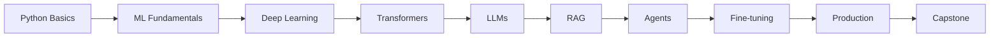

# 📖 Course Summary - Gen AI Masters Program

**Quick Reference Guide for All Topics**

---

## 🎯 Course Structure

### **12 Weeks** | **55 Notebooks** | **6 Projects** | **1 Capstone**

```
Foundations → Deep Learning → LLMs & RAG → Agents → Production
  (2 weeks)      (2 weeks)      (2 weeks)    (2 weeks)  (4 weeks)
```

---

## 📚 Module Breakdown

### **Phase 1: Foundations (Weeks 1-4)**

#### Week 1-2: Python & ML Fundamentals
**Topics:** Python, NumPy, Pandas, Data Preprocessing, Classical ML  
**Key Skills:** Data manipulation, ML basics, sklearn  
**Deliverable:** Data analysis mini-project

<details>
<summary><b>📖 Detailed Topics</b></summary>

1. **Environment Setup**
   - GitHub Codespaces
   - Package management
   - HuggingFace auth

2. **Python Essentials**
   - Control flow, functions
   - OOP basics
   - File I/O, error handling

3. **NumPy & Pandas**
   - Array operations
   - DataFrame manipulation
   - Vectorization

4. **Data Preprocessing**
   - EDA techniques
   - Missing data handling
   - Feature engineering

5. **Classical ML**
   - Supervised/unsupervised learning
   - Model evaluation
   - Cross-validation

</details>

---

#### Week 3-4: Deep Learning & NLP
**Topics:** Neural Networks, CNNs, RNNs, Transformers, HuggingFace  
**Key Skills:** Deep learning, transformer architecture  
**Deliverable:** Text classifier with HuggingFace

<details>
<summary><b>📖 Detailed Topics</b></summary>

1. **Neural Networks**
   - Perceptrons, activation functions
   - Backpropagation
   - Training techniques

2. **CNNs**
   - Convolution, pooling
   - Image classification
   - Transfer learning

3. **RNNs**
   - Sequence models
   - LSTM, GRU
   - Time series

4. **Transformer Architecture**
   - Self-attention mechanism
   - Positional encoding
   - Encoder-decoder

5. **Attention Mechanism**
   - Query, Key, Value
   - Multi-head attention
   - Attention patterns

6. **Embeddings & Tokenization**
   - Word embeddings
   - Tokenization strategies
   - Context windows

7. **HuggingFace Intro**
   - Model Hub
   - Pipelines
   - Inference API

</details>

---

### **Phase 2: LLMs & Advanced NLP (Weeks 5-6)**

#### Week 5-6: LLMs, Prompt Engineering & RAG
**Topics:** LLMs, Prompting, Few-Shot, RAG, Embeddings  
**Key Skills:** Working with LLMs, RAG systems  
**Deliverable:** Domain Q&A system with RAG

<details>
<summary><b>📖 Detailed Topics</b></summary>

1. **LLMs Introduction**
   - LLM architectures
   - Pre-training vs fine-tuning
   - Model selection

2. **HuggingFace Tasks**
   - Sentiment analysis
   - Summarization
   - Translation
   - Q&A, generation

3. **Model Selection & Preprocessing**
   - Choosing right models
   - Tokenizer deep dive
   - SoftMax, inference

4. **Prompt Engineering**
   - Zero-shot prompting
   - Chain-of-thought
   - Role prompting
   - Best practices

5. **Few-Shot Learning**
   - Few-shot examples
   - In-context learning
   - Template design

6. **RAG Introduction**
   - RAG architecture
   - Use cases
   - When to use RAG

7. **RAG Implementation**
   - Document processing
   - Retrieval strategies
   - Generation

8. **Vector Embeddings**
   - Embedding models
   - Similarity search
   - Semantic search

</details>

---

### **Phase 3: Advanced RAG & Agentic AI (Weeks 7-8)**

#### Week 7-8: LangChain, Agents & Advanced RAG
**Topics:** LangChain, LangGraph, Agents, CRAG, Query Optimization  
**Key Skills:** Building intelligent agents, production RAG  
**Deliverable:** Multi-agent data analysis system

<details>
<summary><b>📖 Detailed Topics</b></summary>

1. **LangChain Essentials**
   - Framework overview
   - Core abstractions
   - Integration patterns

2. **LangChain Messages**
   - Message types
   - Chat models
   - Conversation management

3. **Prompt Templates & Chains**
   - Template design
   - LCEL (LangChain Expression Language)
   - Chain composition

4. **Runnable Sequences**
   - Runnables
   - Parallel execution
   - Error handling

5. **Document Loaders**
   - PDF, DOCX, CSV
   - Web scraping
   - Custom loaders

6. **Vector Databases**
   - ChromaDB
   - FAISS
   - Pinecone alternatives

7. **Advanced RAG Patterns**
   - Multi-query RAG
   - Hierarchical RAG
   - Hybrid search

8. **Query Optimization**
   - Query transformation
   - Query routing
   - Reranking

9. **Query Transformation**
   - Query rewrite
   - Multi-query
   - Decomposition

10. **RAG Fusion & Reranking**
    - Reciprocal ranking
    - Score fusion
    - Reranker models

11. **LangGraph Introduction**
    - State graphs
    - Node definition
    - Edge routing

12. **Building Agents**
    - ReAct pattern
    - Tool binding
    - Agent types

13. **Agentic AI Tools**
    - Tool creation
    - Tool calling
    - Multi-tool agents

14. **Agent State Management**
    - State persistence
    - Checkpointing
    - Memory management

15. **Corrective RAG (CRAG)**
    - Self-correction
    - Grading retrieval
    - Fallback strategies

</details>

---

### **Phase 4: Model Training & Fine-tuning (Weeks 9-10)**

#### Week 9-10: Training & Fine-tuning
**Topics:** Pre-training, MLP, LoRA, QLoRA, PEFT  
**Key Skills:** Model training, fine-tuning LLMs  
**Deliverable:** Fine-tuned model for custom task

<details>
<summary><b>📖 Detailed Topics</b></summary>

1. **Pre-training Concepts**
   - Training objectives
   - Data preparation
   - Scaling laws

2. **Bigram Model**
   - Language modeling basics
   - Next token prediction
   - Probability calculation

3. **Tensors & Matrices**
   - Tensor operations
   - Matrix multiplication
   - GPU acceleration

4. **Forward & Backward Pass**
   - Gradient computation
   - Backpropagation
   - Weight updates

5. **MLP Implementation**
   - Feed-forward networks
   - Activation functions
   - Layer stacking

6. **Mini-batch Training**
   - Batch processing
   - Gradient accumulation
   - Optimization

7. **Fine-tuning vs RAG**
   - When to fine-tune
   - When to use RAG
   - Hybrid approaches

8. **PEFT Introduction**
   - Parameter-efficient methods
   - Adapter layers
   - Prefix tuning

9. **LoRA & QLoRA**
   - Low-rank adaptation
   - Quantization
   - Memory optimization

10. **Fine-tuning Practical**
    - Dataset preparation
    - Training loop
    - Hyperparameters

11. **Model Evaluation**
    - Metrics (perplexity, BLEU)
    - Human evaluation
    - Benchmarking

</details>

---

### **Phase 5: Production & Capstone (Weeks 11-12)**

#### Week 11-12: Production Deployment & Capstone
**Topics:** MLOps, FastAPI, Docker, CI/CD, GCP, Terraform  
**Key Skills:** Production deployment, DevOps for ML  
**Deliverable:** Production-grade Gen AI application

<details>
<summary><b>📖 Detailed Topics</b></summary>

1. **MLOps Fundamentals**
   - ML lifecycle
   - Experiment tracking
   - Model versioning

2. **FastAPI ML Serving**
   - REST API design
   - Request validation
   - Async endpoints

3. **Docker Containerization**
   - Dockerfile creation
   - Multi-stage builds
   - docker-compose

4. **Monitoring & Logging**
   - Prometheus metrics
   - Grafana dashboards
   - Log aggregation

5. **CI/CD with GitHub Actions**
   - Workflow automation
   - Testing pipelines
   - Deployment automation

6. **GCP Deployment**
   - Cloud Run
   - Cloud Storage
   - Secret Manager

7. **Terraform IaC**
   - Infrastructure as Code
   - Resource provisioning
   - State management

8. **Kubernetes Orchestration**
   - Pod deployment
   - Service discovery
   - Scaling strategies

</details>

---

## 🎯 Key Concepts by Topic

### Transformers
- **Self-Attention:** Mechanism to weigh input token importance
- **Multi-Head Attention:** Multiple attention mechanisms in parallel
- **Positional Encoding:** Adding position information to embeddings
- **Feed-Forward:** MLP layer after attention
- **Layer Normalization:** Stabilizing training

### RAG (Retrieval-Augmented Generation)
- **Retrieval:** Finding relevant documents from knowledge base
- **Augmentation:** Adding context to LLM prompts
- **Generation:** LLM generates response with context
- **Vector DB:** Storing embeddings for fast retrieval
- **Chunking:** Breaking documents into manageable pieces

### LangChain
- **Chains:** Sequences of LLM calls and processing
- **Agents:** Autonomous decision-making with tools
- **Memory:** Maintaining conversation context
- **Retrievers:** Fetching relevant information
- **Tools:** External capabilities (search, calculator, etc.)

### LangGraph
- **State Graph:** Nodes representing processing steps
- **Edges:** Transitions between states
- **Conditional Routing:** Dynamic path selection
- **Checkpointing:** State persistence for recovery
- **Human-in-the-loop:** Pause for human input

### Fine-tuning
- **Full Fine-tuning:** Update all model parameters
- **PEFT:** Update only a subset of parameters
- **LoRA:** Low-rank matrix adaptation
- **QLoRA:** Quantized LoRA for memory efficiency
- **Adapter Layers:** Small trainable modules

---

## 🛠️ Tech Stack Summary

### Languages & Frameworks
- **Python 3.10+:** Main programming language
- **PyTorch:** Deep learning framework
- **Transformers:** HuggingFace library
- **LangChain:** LLM application framework
- **LangGraph:** Agent orchestration
- **FastAPI:** Web framework

### Data & Storage
- **NumPy:** Numerical computing
- **Pandas:** Data manipulation
- **ChromaDB:** Vector database
- **FAISS:** Similarity search
- **PostgreSQL:** Relational database
- **Redis:** Caching

### ML & AI
- **HuggingFace Hub:** Model repository
- **sentence-transformers:** Embeddings
- **PEFT:** Parameter-efficient fine-tuning
- **bitsandbytes:** Quantization

### DevOps & Cloud
- **Docker:** Containerization
- **Terraform:** Infrastructure as Code
- **GitHub Actions:** CI/CD
- **GCP:** Cloud platform
- **Prometheus:** Monitoring
- **Grafana:** Visualization

---

## 📊 Assessment Checkpoints

| Week | Checkpoint | Assessment Type | Pass Criteria |
|------|-----------|-----------------|---------------|
| 2 | Python & ML | Quiz + Coding | 70%+ |
| 4 | Transformers | Implementation | Working code |
| 6 | RAG Application | Project | Deployed app |
| 8 | Multi-Agent System | Project | Functional agents |
| 10 | Fine-tuned Model | Evaluation | Metrics > baseline |
| 12 | Capstone | Presentation | Production deployment |

---

## 🎓 Learning Outcomes

### Technical Skills
✅ Python for ML/AI  
✅ Deep learning with PyTorch  
✅ Transformer architecture  
✅ Working with LLMs  
✅ Building RAG systems  
✅ Creating AI agents  
✅ Fine-tuning models  
✅ Production deployment  
✅ MLOps practices  

### Tools & Frameworks
✅ HuggingFace ecosystem  
✅ LangChain & LangGraph  
✅ Vector databases  
✅ FastAPI for ML serving  
✅ Docker & Kubernetes  
✅ CI/CD pipelines  
✅ Cloud deployment (GCP)  

### Soft Skills
✅ Problem-solving  
✅ Debugging  
✅ Documentation  
✅ Version control  
✅ Project management  

---

## 📈 Progression Path



---

## 🔑 Key Terminology

### General ML
- **Model:** Mathematical function learned from data
- **Training:** Process of learning from data
- **Inference:** Using trained model for predictions
- **Epoch:** One pass through entire dataset
- **Batch:** Subset of data processed together

### Gen AI Specific
- **LLM:** Large Language Model
- **Prompt:** Input text to LLM
- **Context:** Information provided with prompt
- **Token:** Unit of text (word/subword)
- **Embedding:** Vector representation of text
- **Fine-tuning:** Adapting pre-trained model
- **Zero-shot:** No training examples
- **Few-shot:** Few training examples

### RAG Specific
- **Retrieval:** Finding relevant documents
- **Augmentation:** Adding context to prompt
- **Vector Store:** Database of embeddings
- **Chunking:** Splitting documents
- **Similarity Search:** Finding similar embeddings

### Production ML
- **MLOps:** ML + DevOps practices
- **Serving:** Making model available via API
- **Monitoring:** Tracking model performance
- **CI/CD:** Continuous Integration/Deployment
- **IaC:** Infrastructure as Code

---

## 📚 Recommended Reading Order

### Week 1-2
1. README.md
2. GETTING_STARTED.md
3. week-01-02-python-ml-foundations/README.md
4. Start notebooks

### Week 3-4
1. "Attention Is All You Need" paper (optional)
2. HuggingFace course
3. Week 3-4 notebooks

### Week 5-6
1. LangChain documentation
2. RAG survey paper (optional)
3. Week 5-6 notebooks

### Week 7-8
1. LangGraph tutorials
2. ReAct paper (optional)
3. Week 7-8 notebooks

### Week 9-10
1. LoRA paper (optional)
2. PEFT documentation
3. Week 9-10 notebooks

### Week 11-12
1. CAPSTONE_PROJECT.md
2. Production best practices
3. Start building!

---

## 🎯 Success Metrics

### By Week 4
- [ ] Built transformer from scratch
- [ ] Used HuggingFace models
- [ ] Completed 2 homework assignments

### By Week 8
- [ ] Built RAG application
- [ ] Created multi-agent system
- [ ] Deployed locally

### By Week 12
- [ ] Fine-tuned a model
- [ ] Deployed to production
- [ ] Completed capstone
- [ ] Portfolio ready

---

## 💡 Pro Tips

1. **Code Along:** Don't just read, implement
2. **Experiment:** Modify examples
3. **Document:** Write notes as you learn
4. **Share:** Post progress on LinkedIn
5. **Review:** Revisit previous weeks
6. **Ask:** No question is stupid
7. **Build:** Apply to personal projects

---

## 🔗 Essential Links

- [Main README](./README.md)
- [Getting Started](./GETTING_STARTED.md)
- [Quick Start](./QUICK_START.md)
- [Progress Tracker](./PROGRESS_TRACKER.md)
- [FAQ](./FAQ.md)
- [Capstone Project](./CAPSTONE_PROJECT.md)

---

## 📊 Time Commitment

| Activity | Hours/Week |
|----------|------------|
| Watching/Reading | 5-7 |
| Coding | 5-7 |
| Homework | 3-4 |
| Review | 2-3 |
| **Total** | **15-21** |

**Total Course:** 180-250 hours over 12 weeks

---

## 🏆 Completion Certificate

Upon finishing:
- ✅ All 55 notebooks
- ✅ 6 homework assignments
- ✅ 6 checkpoints
- ✅ Capstone project

You'll have:
- 🎯 Production-ready portfolio
- 🚀 Deployed Gen AI application
- 📚 Comprehensive GitHub repo
- 💼 Resume-worthy project

---

<div align="center">

**Course Summary** | Gen AI Masters Program | Your Complete Reference

[🏠 Home](./README.md) | [⚡ Quick Start](./QUICK_START.md) | [📊 Track Progress](./PROGRESS_TRACKER.md)

</div>
